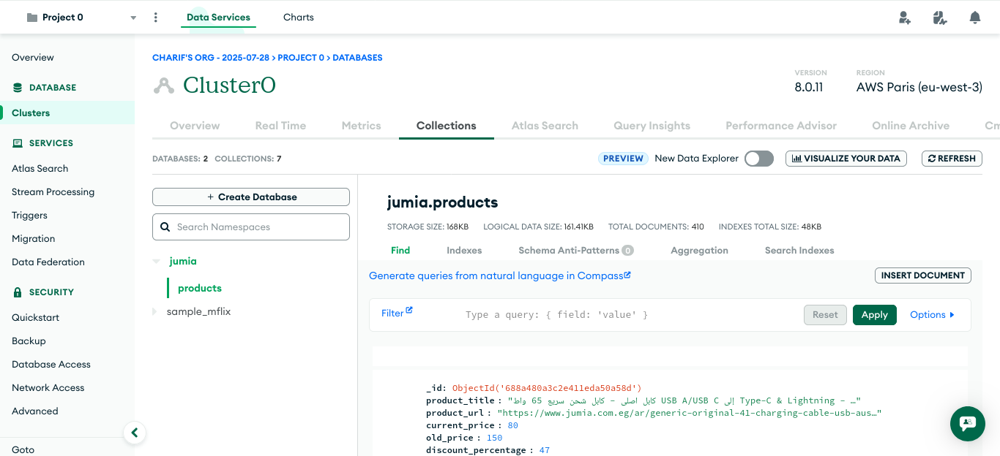

# 🛒 Jumia Web Scraper and MongoDB Integration


## Overview

This project is a functional and scalable **web scraping tool** that extracts **over 1000 real product listings** from [Jumia](https://www.jumia.com.eg/ar), one of Africa’s largest e-commerce platforms. It uses **Selenium** for dynamic content scraping and stores the structured data in a **MongoDB Atlas** cloud database.

The project demonstrates my ability to work with:
- Web automation and scraping using **Selenium WebDriver**
- Data extraction and cleaning using **Python and Regex**
- NoSQL database integration using **MongoDB**
- Automation best practices (modular functions, headless browser, user-agent spoofing)
---

## Features

- 🚀 Extracts product details such as:
  - Product title
  - Product URL
  - Current price
  - Old price (if available)
- Automatically saves product data in `jumia.products` collection on MongoDB Atlas
- Modular design with reusable scraping and driver initialization functions
- Headless scraping support (no GUI browser needed)
- Price parsing and formatting with regex for data consistency

---

## Technologies Used

- **Python**
- **Selenium**
- **MongoDB Atlas (Cloud)**
- **Regex**
- **GeckoDriver + Firefox**

---

## Example Output (MongoDB Atlas)



Each document in the database has this structure:

```json
{"_id":{"$oid":"688a480a3c2e411eda50a58d"},
"product_title":"كابل اصلي - كابل شحن سريع 65 واط USB A/USB C إلى Type-C & Lightning - SS272- كابل شحن جودة عالية 4*1 - كابل شحن ايفون - كابل شحن تايب سى - كابل شحن نينجا",
"product_url":"https://www.jumia.com.eg/ar/generic-original-41-charging-cable-usb-ausb-c-to-type-c-lightning-65w-fast-turbo-charging-cable-130124149.html",
"current_price":{"$numberInt":"80"},
"old_price":{"$numberInt":"150"},
"discount_percentage":{"$numberInt":"47"},
"discount_quantity":{"$numberInt":"70"},
"inserted_at":{"$date":{"$numberLong":"1753896474888"}},
"updated_at":{"$date":{"$numberLong":"1753896474888"}},
"published_at":false}
````

---
